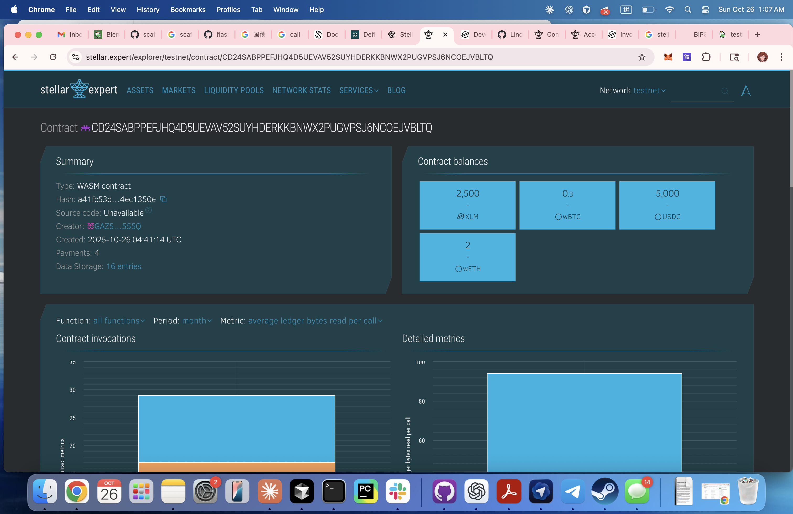
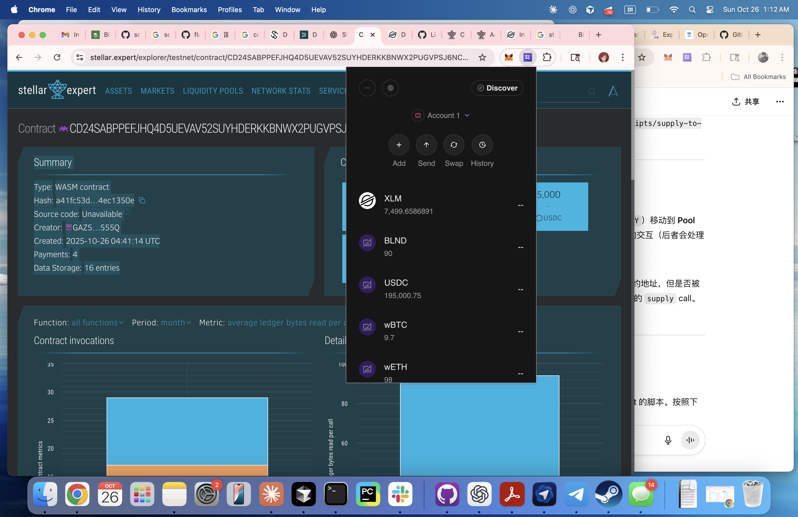
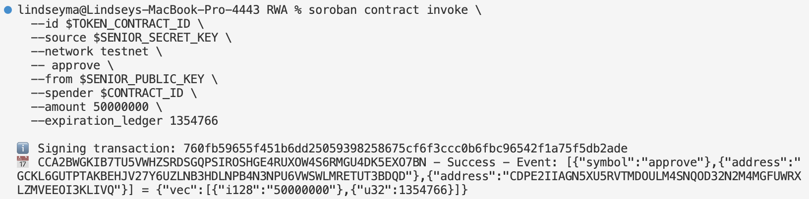
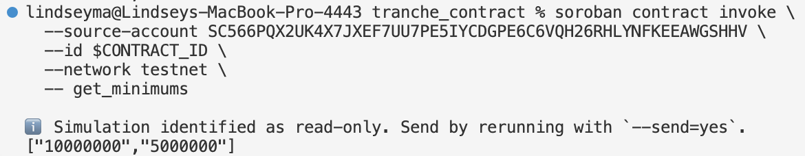
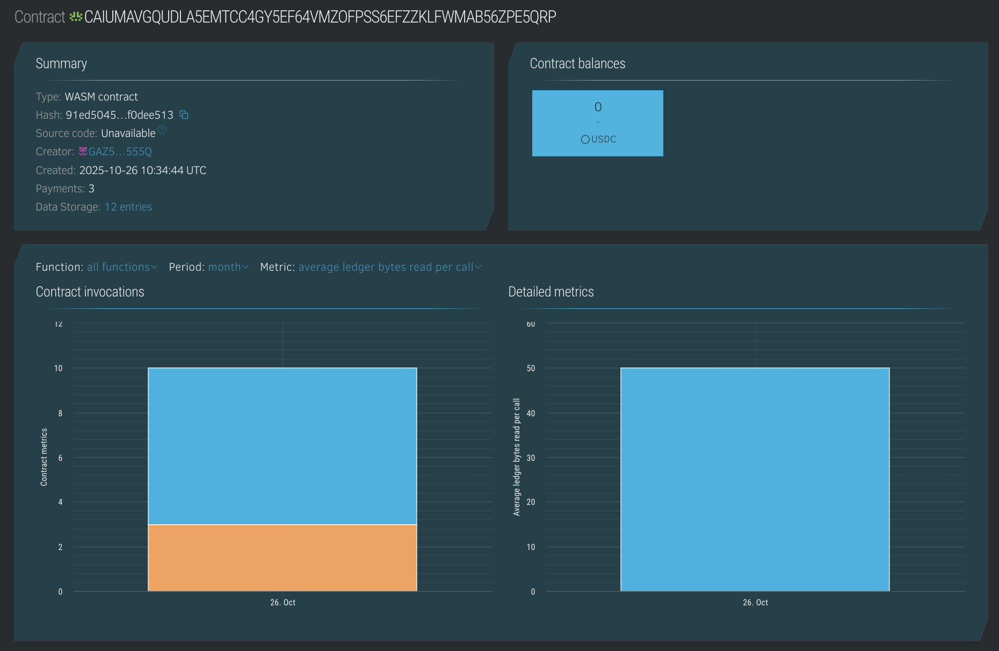
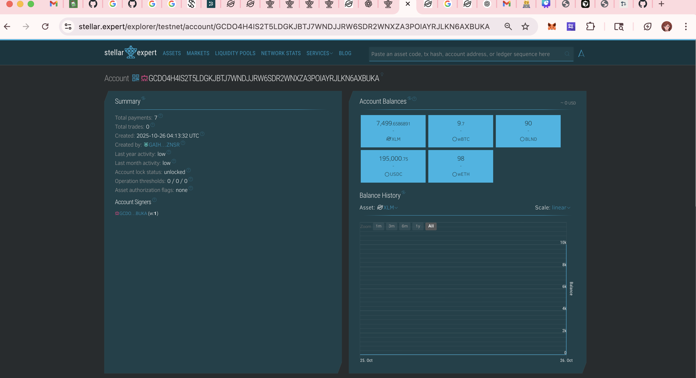

# 💰 STRATAFI — Risk-Adjusted Yield for On-Chain Real-World Assets 💰

> **RWA Tranche** brings structured yield tranching (Senior / Junior layers) to tokenized Real-World Assets (RWAs) on **Stellar**, enabling **risk-adjusted, transparent, and automated yield distribution** through Soroban smart contracts.

video link: https://drive.google.com/drive/folders/1CsJ5002g4GsyauiBjsTzUvHHfgNFm8Vd?usp=drive_link  
you could run it locally with npm run dev easily on localhost:3000 with https://github.com/Lindsey-cyber/stellar (our very pretty frontend deployment)(but you need enough testnet XLM and USDCs to get the functions work. otherwise the transactions will fail)  
---
## 🚀 Overview

Real-World Assets (RWAs) such as tokenized Treasury bills are rapidly growing on Stellar — yet most of them are **static holdings** that lack yield differentiation or risk management mechanisms.

In traditional finance, **tranching** redistributes yield and risk:  
- **Senior tranches** earn stable returns with protection.  
- **Junior tranches** take higher risk for higher potential yield.

**RWA Tranche** brings this mechanism on-chain using Soroban smart contracts, creating a composable and transparent DeFi primitive for structured yield products.

---## 🔍 Background Concepts

### 🏦 Real-World Assets (RWAs) on Stellar
**RWAs** are off-chain financial or physical assets — e.g., Treasury bills, corporate bonds, or cash-flow streams — **represented on-chain as tokenized claims**.  

Stellar advantages for RWAs:
- Native asset issuance and trustline model  
- Fast, low-cost transfers  
- Programmable contracts with Soroban  

In this project, **RWA tokens** act as the yield-generating base for tranches. Periodic interest or revenue flows from the RWA pool into the tranche contracts.

### 🧮 Tranches in Traditional Finance
A **tranche** (“slice”) segments a pool of assets into layers with **different risk-return and repayment priorities**:  
- **Senior** → priority yield, protected from losses; lower risk/reward  
- **Junior** → absorbs losses first; higher risk/reward  
- (Optional) **Mezzanine** → intermediate risk/reward  

**On-chain adaptation:**  
- Senior/Junior tokens minted by the Soroban contract  
- Yield allocation prioritizes Senior tranche  
- Losses first absorbed by Junior tranche  

This mirrors traditional finance mechanics in a fully decentralized, programmable environment.

---
|  |  |
|---|---|
|  |  |
|  |  |
---
some of our key addresses(whale, admin, etc) and key contract explorer and key transactions:
pool contract: https://stellar.expert/explorer/testnet/contract/CD24SABPPEFJHQ4D5UEVAV52SUYHDERKKBNWX2PUGVPSJ6NCOEJVBLTQ  
tranche contract: https://stellar.expert/explorer/testnet/contract/CDPE2IIAGN5XU5RVTMDOULM4SNQOD32N2M4MGFUWRXLZMVEEOI3KLIVQ?filter=users  
contract initialization sample: https://stellar.expert/explorer/testnet/tx/5386546119200768  
whale address: https://stellar.expert/explorer/testnet/account/GCDO4H4IS2T5LDGKJBTJ7WNDJJRW6SDR2WNXZA3POIAYRJLKN6AXBUKA  
our 16 testing run which guaranteed the whole process smoothness:  
see the bottom of the readme. they are very important! please read! there are 16 of them!  
---

## 🧩 How It Works

1. **RWA Tokenization:**  
   - Issue tokenized RWAs (e.g., RWA_UST) on Stellar Testnet via Soroban token contract.  
   - Mint tokens to issuer/custodian accounts.

2. **Blend Pool Integration:**  
   - Deposit RWA tokens into a **Blend pool** to simulate yield generation.  
   - Pool emits payouts triggered manually (demo) or via oracle (production).

3. **Tranche Contract Deployment (Soroban):**  
   - Mint **Senior** and **Junior tranche tokens**.  
   - Users subscribe with XLM/USDC.  
   - On pool payout:  
     - Senior tranche receives yield first  
     - Junior receives remaining  
   - On losses: Junior absorbs first, Senior protected.

4. **User Interaction:**  
   - Subscribe, redeem, or switch tranches via smart contract calls.  
   - Admin can pause/resume, update minimums, or trigger payouts.

---

## 💡 Why We Built It

- Current RWA tokens on Stellar offer **flat, undifferentiated returns**.
- There’s **no way for users to express risk appetite** or build layered yield strategies.
- We wanted to make RWAs not just exist on-chain — but **work** on-chain.

Our goal:  
> Transform RWAs from passive tokens into **dynamic yield-generating building blocks** for the Stellar DeFi ecosystem.

---

## ⚙️ How It Works

### 🎯 Core Architecture

RWA Tranche uses **Soroban smart contracts** integrated with **Blend Pool** to create structured products with automatic yield distribution.

| Component | Description |
|------------|-------------|
| **Tranche Contract** | Core logic for Senior / Junior token issuance, yield allocation, and loss absorption. |
| **Underlying Pool (Blend Pool)** | Simulates the yield source (e.g., Treasury returns). |
| **Benefit Simulator** | Injects simulated periodic yield for testing and demo. |

### 💵 Yield & Risk Logic

- **Senior Tranche** → Receives yield first, bears losses last (low-risk, stable return).  
- **Junior Tranche** → Receives yield last, absorbs losses first (high-risk, high return).  

**Workflow:**
1. Users deposit into Senior or Junior tranches.  
2. Underlying yield (from RWA) flows into the pool periodically.  
3. Smart contract allocates yield by priority.  
4. In case of loss, Junior absorbs first.  
5. Users can redeem at any time.  

---

## 🧱 Technical Highlights

- On-chain yield allocation & loss absorption logic  
- Soroban smart contract–based **risk isolation**  
- Dynamic parameters: pause, resume, rebalance  
- Automated periodic yield distribution  
- Cross-contract integration with **Blend Pool**  
- Transparent event logs for every on-chain action  

---

## 🔍 Contracts & Deployment

| Module | Contract ID / Address | Description |
|--------|----------------------|-------------|
| **Tranche Contract** | `CAIUMAVGQUDLA5EMTCC4GY5EF64VMZOFPSS6EFZZKLFWMAB56ZPE5QRP` | Core yield-tranching logic |
| **Blend Pool** | `CD24SABPPEFJHQ4D5UEVAV52SUYHDERKKBNWX2PUGVPSJ6NCOEJVBLTQ` | Simulated RWA yield source |
| **RWA Benefit Simulator** | `CCA2BWGKIB7TU5VWHZSRDSGQPSIROSHGE4RUXOW4S6RMGU4DK5EXO7BN` | Demo yield generator |
| **Admin Account** | `GAZ57ZNVBFTYPAR7EVW7LISVT5ZYU2FFHB7Q5YC74KDUXNILIVM7555Q` | Contract owner / manager |

🔗 [Tranche Contract on Stellar Expert](https://stellar.expert/explorer/testnet/contract/CAIUMAVGQUDLA5EMTCC4GY5EF64VMZOFPSS6EFZZKLFWMAB56ZPE5QRP)  
🔗 [Blend Pool Explorer Link](https://stellar.expert/explorer/testnet/contract/CD24SABPPEFJHQ4D5UEVAV52SUYHDERKKBNWX2PUGVPSJ6NCOEJVBLTQ)

---

## 🧪 Demo Highlights

✅ Senior & Junior tranche subscription / redemption  
✅ Automatic yield allocation by priority  
✅ Simulated loss handling (Junior first loss)  
✅ Pause & governance parameter updates  
✅ Full on-chain event tracking  

Example transaction:  
[Yield distribution transaction](https://stellar.expert/explorer/testnet/tx/5377406428782592)

---

## 🌍 Why It Fits Stellar

> “Brew bold ideas and experiment without limits.”

RWA Tranche embodies Stellar’s hackathon spirit:

- 🔹 **DeFi innovation** — structured yield as a native primitive  
- 🔹 **RWA liquidity activation** — making tokenized bonds productive  
- 🔹 **Smart-contract interoperability** — Soroban + Blend integration  
- 🔹 **Stablecoin-driven yield options** — risk-adjusted on-chain returns  

---

## 🧭 Vision

We aim to make **on-chain RWAs as dynamic and flexible as traditional credit markets** —  
where risk and return are transparent, programmable, and composable.

**Future directions:**
- Standardized yield-tranching module for RWA projects  
- Composable RWA-backed yield layer for DeFi  
- Institutional yield management tools built on Stellar  

---

## 🛠️ Tech Stack

- **Language:** Rust  
- **Smart Contracts:** Soroban (WASM)  
- **DeFi Protocol:** Blend Pool  
- **Network:** Stellar Testnet  
- **Tools:** Soroban CLI, Stellar SDK, Blend SDK  
- **Explorer:** [stellar.expert](https://stellar.expert)

---

## 📜 License

MIT License © 2025 **RWA Tranche Team**

---

## ✉️ Contact

Built with ❤️ by **Lindsey & Tatyana**  
For **Stellar Hackathon 2025** — *“Brew bold ideas.”*

---
16 test runs:
1. deploy the contract code:
lindseyma@Lindseys-MacBook-Pro-4443 RWA % soroban contract deploy \
  --wasm /Users/lindseyma/Documents/GitHub/RWA/contracts/tranche_contract/target/wasm32v1-none/release/tranche_co
ntract.wasm \ 
  --source-account $ADMIN_SECRET_KEY \
  --network testnet

2. initialization code: soroban contract invoke \
  --id $CONTRACT_ID \                                                           
  --source-account $ADMIN_SECRET_KEY \
  --network testnet \                                                            
  -- initialize \                                                               
  --admin $ADMIN_PUBLIC_KEY \
  --token_contract_id $USDC_ID \
  --pool_contract_id $POOL_CONTRACT_ID \
  --min_senior 10000000 \
  --min_junior 5000000
hash: aa6164a935bfaca99f914bf02795e4d3d8f340d8ed7d323f8845953d5b2e7bf5

3. senior approval code:
soroban contract invoke \
  --id $USDC_ID \
  --source $SENIOR_SECRET_KEY \
  --network testnet \
  -- approve \
  --from $SENIOR_PUBLIC_KEY \
  --spender $CONTRACT_ID_2 \
  --amount 50000000 \
  --expiration_ledger 1354766
hash: 3396e5b88c015465faa9cbe2c58bc58612e99d32594c708a8dda18ea09ac6ba2

4. senior buy code:
soroban contract invoke \
  --id $CONTRACT_ID_2 \
  --source $SENIOR_SECRET_KEY \
  --network testnet \
  -- subscribe \
  --from $SENIOR_PUBLIC_KEY \
  --tranche '{"Senior": {}}' \
  --amount 50000000
hash: ℹ️  Signing transaction: c570e61015ba72798e27647c79176ff95383823355fa3562e9efb97ecfcc9308
📅 CBIELTK6YBZJU5UP2WWQEUCYKLPU6AUNZ2BQ4WWFEIE3USCIHMXQDAMA - Success - Event: [{"symbol":"transfer"},{"address":"GCKL6GUTPTAKBEHJV27Y6UZLNB3HDLNPB4N3NPU6VWSWLMRETUT3BDQD"},{"address":"CAIUMAVGQUDLA5EMTCC4GY5EF64VMZOFPSS6EFZZKLFWMAB56ZPE5QRP"},{"string":"USDC:GBBD47IF6LWK7P7MDEVSCWR7DPUWV3NY3DTQEVFL4NAT4AQH3ZLLFLA5"}] = {"i128":"50000000"}
📅 CAIUMAVGQUDLA5EMTCC4GY5EF64VMZOFPSS6EFZZKLFWMAB56ZPE5QRP - Success - Event: [{"symbol":"sub"}] = {"vec":[{"address":"GCKL6GUTPTAKBEHJV27Y6UZLNB3HDLNPB4N3NPU6VWSWLMRETUT3BDQD"},{"vec":[{"symbol":"Senior"}]},{"i128":"50000000"}]}

5. junior approval code:
soroban contract invoke \
  --id $USDC_ID \
  --source $JUNIOR_SECRET_KEY \
  --network testnet \
  -- approve \
  --from $JUNIOR_PUBLIC_KEY \
  --spender $CONTRACT_ID_2 \
  --amount 30000000 \
  --expiration_ledger 1354766
hash: ℹ️  Signing transaction: 194f8cbfc7879ca8d1c75b7c5d13ae443a3dca635fa8a484ab6c9ac7645a5df8
📅 CBIELTK6YBZJU5UP2WWQEUCYKLPU6AUNZ2BQ4WWFEIE3USCIHMXQDAMA - Success - Event: [{"symbol":"approve"},{"address":"GCD3FU576HQLD3NIY4AMH6XYHOHQUZIK2FXDTOZXP62ALNTW7RUMDOAM"},{"address":"CAIUMAVGQUDLA5EMTCC4GY5EF64VMZOFPSS6EFZZKLFWMAB56ZPE5QRP"},{"string":"USDC:GBBD47IF6LWK7P7MDEVSCWR7DPUWV3NY3DTQEVFL4NAT4AQH3ZLLFLA5"}] = {"vec":[{"i128":"30000000"},{"u32":1354766}]}

6. junior buy code:
soroban contract invoke \
  --id $CONTRACT_ID_2 \
  --source $JUNIOR_SECRET_KEY \
  --network testnet \
  -- subscribe \
  --from $JUNIOR_PUBLIC_KEY \
  --tranche '{"Junior": {}}' \
  --amount 30000000

ℹ️  Signing transaction: 60fff65763f01e1fb522a669064f3138ed455c7514ff080d2f8c64f4bcd8dfa1
📅 CBIELTK6YBZJU5UP2WWQEUCYKLPU6AUNZ2BQ4WWFEIE3USCIHMXQDAMA - Success - Event: [{"symbol":"transfer"},{"address":"GCD3FU576HQLD3NIY4AMH6XYHOHQUZIK2FXDTOZXP62ALNTW7RUMDOAM"},{"address":"CAIUMAVGQUDLA5EMTCC4GY5EF64VMZOFPSS6EFZZKLFWMAB56ZPE5QRP"},{"string":"USDC:GBBD47IF6LWK7P7MDEVSCWR7DPUWV3NY3DTQEVFL4NAT4AQH3ZLLFLA5"}] = {"i128":"30000000"}
📅 CAIUMAVGQUDLA5EMTCC4GY5EF64VMZOFPSS6EFZZKLFWMAB56ZPE5QRP - Success - Event: [{"symbol":"sub"}] = {"vec":[{"address":"GCD3FU576HQLD3NIY4AMH6XYHOHQUZIK2FXDTOZXP62ALNTW7RUMDOAM"},{"vec":[{"symbol":"Junior"}]},{"i128":"30000000"}]}

7. check status code:
soroban contract invoke --id $CONTRACT_ID_2 --network testnet --source-account $ADMIN_SECRET_KEY -- get_user_share --user $SENIOR_PUBLIC_KEY --tranche '{"Senior": {}}'
soroban contract invoke --id $CONTRACT_ID_2 --network testnet --source-account $ADMIN_SECRET_KEY -- get_user_share --user $JUNIOR_PUBLIC_KEY --tranche '{"Junior": {}}'
soroban contract invoke --id $CONTRACT_ID_2 --network testnet --source-account $ADMIN_SECRET_KEY -- get_totals

ℹ️  Simulation identified as read-only. Send by rerunning with --send=yes.
"50000000"
ℹ️  Simulation identified as read-only. Send by rerunning with --send=yes.
"30000000"
ℹ️  Simulation identified as read-only. Send by rerunning with --send=yes.
["50000000","30000000"]

8. admin approve revenue:
soroban contract invoke \
  --id $USDC_ID \
  --source $ADMIN_SECRET_KEY \
  --network testnet \
  -- approve \
  --from $ADMIN_PUBLIC_KEY \
  --spender $CONTRACT_ID_2 \
  --amount 60000000 \
  --expiration_ledger 1354766
ℹ️  Signing transaction: d287e5d71bb920c8a5904348ff1e8369568654f4478fe9d1c38ffe7d0497006c
📅 CBIELTK6YBZJU5UP2WWQEUCYKLPU6AUNZ2BQ4WWFEIE3USCIHMXQDAMA - Success - Event: [{"symbol":"approve"},{"address":"GAZ57ZNVBFTYPAR7EVW7LISVT5ZYU2FFHB7Q5YC74KDUXNILIVM7555Q"},{"address":"CAIUMAVGQUDLA5EMTCC4GY5EF64VMZOFPSS6EFZZKLFWMAB56ZPE5QRP"},{"string":"USDC:GBBD47IF6LWK7P7MDEVSCWR7DPUWV3NY3DTQEVFL4NAT4AQH3ZLLFLA5"}] = {"vec":[{"i128":"60000000"},{"u32":1354766}]}

9. admin notice revenue:
soroban contract invoke \
  --id $CONTRACT_ID_2 \
  --source $ADMIN_SECRET_KEY \
  --network testnet \
  -- notify_pool_payout \
  --caller $ADMIN_PUBLIC_KEY \
  --amount 60000000
  --amount 60000000
ℹ️  Signing transaction: 8f6c6b1e1d1f95bb8db74d7a8c1aa22f63756cd6d9d70e89003b6a3a0ca214db
📅 CBIELTK6YBZJU5UP2WWQEUCYKLPU6AUNZ2BQ4WWFEIE3USCIHMXQDAMA - Success - Event: [{"symbol":"transfer"},{"address":"CAIUMAVGQUDLA5EMTCC4GY5EF64VMZOFPSS6EFZZKLFWMAB56ZPE5QRP"},{"address":"GCKL6GUTPTAKBEHJV27Y6UZLNB3HDLNPB4N3NPU6VWSWLMRETUT3BDQD"},{"string":"USDC:GBBD47IF6LWK7P7MDEVSCWR7DPUWV3NY3DTQEVFL4NAT4AQH3ZLLFLA5"}] = {"i128":"37500000"}
📅 CAIUMAVGQUDLA5EMTCC4GY5EF64VMZOFPSS6EFZZKLFWMAB56ZPE5QRP - Success - Event: [{"symbol":"pay"}] = {"vec":[{"address":"GCKL6GUTPTAKBEHJV27Y6UZLNB3HDLNPB4N3NPU6VWSWLMRETUT3BDQD"},{"vec":[{"symbol":"Senior"}]},{"i128":"37500000"}]}
📅 CBIELTK6YBZJU5UP2WWQEUCYKLPU6AUNZ2BQ4WWFEIE3USCIHMXQDAMA - Success - Event: [{"symbol":"transfer"},{"address":"CAIUMAVGQUDLA5EMTCC4GY5EF64VMZOFPSS6EFZZKLFWMAB56ZPE5QRP"},{"address":"GCD3FU576HQLD3NIY4AMH6XYHOHQUZIK2FXDTOZXP62ALNTW7RUMDOAM"},{"string":"USDC:GBBD47IF6LWK7P7MDEVSCWR7DPUWV3NY3DTQEVFL4NAT4AQH3ZLLFLA5"}] = {"i128":"22500000"}
📅 CAIUMAVGQUDLA5EMTCC4GY5EF64VMZOFPSS6EFZZKLFWMAB56ZPE5QRP - Success - Event: [{"symbol":"pay"}] = {"vec":[{"address":"GCD3FU576HQLD3NIY4AMH6XYHOHQUZIK2FXDTOZXP62ALNTW7RUMDOAM"},{"vec":[{"symbol":"Junior"}]},{"i128":"22500000"}]}
📅 CAIUMAVGQUDLA5EMTCC4GY5EF64VMZOFPSS6EFZZKLFWMAB56ZPE5QRP - Success - Event: [{"symbol":"psum"}] = {"vec":[{"address":"GAZ57ZNVBFTYPAR7EVW7LISVT5ZYU2FFHB7Q5YC74KDUXNILIVM7555Q"},{"i128":"60000000"},{"i128":"37500000"},{"i128":"22500000"}]}

10. admin handle loss:
LOSS_AMOUNT=20000000
soroban contract invoke \
  --id $CONTRACT_ID_2 \
  --source $ADMIN_SECRET_KEY \
  --network testnet \
  -- apply_loss \
  --admin $ADMIN_PUBLIC_KEY \
  --loss_amount 20000000
ℹ️  Signing transaction: 7d7df87bb49201fcbd1b442f9373805c8bb3bd151465347619292ac6c689e452
📅 CAIUMAVGQUDLA5EMTCC4GY5EF64VMZOFPSS6EFZZKLFWMAB56ZPE5QRP - Success - Event: [{"symbol":"loss"}] = {"vec":[{"address":"GAZ57ZNVBFTYPAR7EVW7LISVT5ZYU2FFHB7Q5YC74KDUXNILIVM7555Q"},{"i128":"20000000"}]}

11. account balance after loss:
soroban contract invoke --id $CONTRACT_ID_2 --network testnet --source-account $ADMIN_SECRET_KEY -- get_user_share --user $SENIOR_PUBLIC_KEY --tranche '{"Senior": {}}'
soroban contract invoke --id $CONTRACT_ID_2 --network testnet --source-account $ADMIN_SECRET_KEY -- get_user_share --user $JUNIOR_PUBLIC_KEY --tranche '{"Junior": {}}'
soroban contract invoke --id $CONTRACT_ID_2 --network testnet --source-account $ADMIN_SECRET_KEY -- get_totals

ℹ️  Simulation identified as read-only. Send by rerunning with --send=yes.
"50000000"
ℹ️  Simulation identified as read-only. Send by rerunning with --send=yes.
"10000000"
ℹ️  Simulation identified as read-only. Send by rerunning with --send=yes.
["50000000","10000000"]

12. senior redeem:
lindseyma@Lindseys-MacBook-Pro-4443 RWA % soroban contract invoke \
  --id $CONTRACT_ID_2 \
  --source $SENIOR_SECRET_KEY \
  --network testnet \
  -- redeem \
  --from $SENIOR_PUBLIC_KEY \
  --tranche '{"Senior": {}}' \
  --amount 100000000

❌ error: transaction simulation failed: HostError: Error(WasmVm, InvalidAction)

Event log (newest first):
   0: [Diagnostic Event] contract:CAIUMAVGQUDLA5EMTCC4GY5EF64VMZOFPSS6EFZZKLFWMAB56ZPE5QRP, topics:[error, Error(WasmVm, InvalidAction)], data:["VM call trapped: UnreachableCodeReached", redeem]
   1: [Diagnostic Event] topics:[fn_call, CAIUMAVGQUDLA5EMTCC4GY5EF64VMZOFPSS6EFZZKLFWMAB56ZPE5QRP, redeem], data:[GCKL6GUTPTAKBEHJV27Y6UZLNB3HDLNPB4N3NPU6VWSWLMRETUT3BDQD, [Senior], 100000000]

ℹ️  Signing transaction: 3fbca35c03c113a2d92ffa76ac247ab04f1ca9ddc77d33fed28b2fe9e72d9667
📅 CBIELTK6YBZJU5UP2WWQEUCYKLPU6AUNZ2BQ4WWFEIE3USCIHMXQDAMA - Success - Event: [{"symbol":"transfer"},{"address":"CAIUMAVGQUDLA5EMTCC4GY5EF64VMZOFPSS6EFZZKLFWMAB56ZPE5QRP"},{"address":"GCKL6GUTPTAKBEHJV27Y6UZLNB3HDLNPB4N3NPU6VWSWLMRETUT3BDQD"},{"string":"USDC:GBBD47IF6LWK7P7MDEVSCWR7DPUWV3NY3DTQEVFL4NAT4AQH3ZLLFLA5"}] = {"i128":"10000000"}
📅 CAIUMAVGQUDLA5EMTCC4GY5EF64VMZOFPSS6EFZZKLFWMAB56ZPE5QRP - Success - Event: [{"symbol":"redeem"}] = {"vec":[{"address":"GCKL6GUTPTAKBEHJV27Y6UZLNB3HDLNPB4N3NPU6VWSWLMRETUT3BDQD"},{"vec":[{"symbol":"Senior"}]},{"i128":"10000000"}]}

13. senior redeem balance less than redeem amount:
soroban contract invoke \
  --id $CONTRACT_ID_2 \
  --source $SENIOR_SECRET_KEY \
  --network testnet \
  -- redeem \
  --from $SENIOR_PUBLIC_KEY \
  --tranche '{"Senior": {}}' \
  --amount 100000000

❌ error: transaction simulation failed: HostError: Error(WasmVm, InvalidAction)

Event log (newest first):
   0: [Diagnostic Event] contract:CAIUMAVGQUDLA5EMTCC4GY5EF64VMZOFPSS6EFZZKLFWMAB56ZPE5QRP, topics:[error, Error(WasmVm, InvalidAction)], data:["VM call trapped: UnreachableCodeReached", redeem]
   1: [Diagnostic Event] topics:[fn_call, CAIUMAVGQUDLA5EMTCC4GY5EF64VMZOFPSS6EFZZKLFWMAB56ZPE5QRP, redeem], data:[GCKL6GUTPTAKBEHJV27Y6UZLNB3HDLNPB4N3NPU6VWSWLMRETUT3BDQD, [Senior], 100000000]

14. admin pause:
soroban contract invoke \
  --id $CONTRACT_ID_2 \
  --source $ADMIN_SECRET_KEY \
  --network testnet \
  -- set_paused \
  --admin $ADMIN_PUBLIC_KEY \
  --paused true
ℹ️  Signing transaction: e0477d5262021a4ec9e02ce15d6f4f89279bb523abd8bd7a1e94fd2c0319e1da
📅 CAIUMAVGQUDLA5EMTCC4GY5EF64VMZOFPSS6EFZZKLFWMAB56ZPE5QRP - Success - Event: [{"symbol":"pause"}] = {"vec":[{"bool":true}]}

15. admin recover:
soroban contract invoke \
  --id $CONTRACT_ID_2 \
  --source $ADMIN_SECRET_KEY \
  --network testnet \
  -- set_paused \
  --admin $ADMIN_PUBLIC_KEY \
  --paused false

ℹ️  Signing transaction: 0e6015ed00d0eaf8f7e77c4f5853ae9c53ef06ec66bd532d1e856b05d936e2ee
📅 CAIUMAVGQUDLA5EMTCC4GY5EF64VMZOFPSS6EFZZKLFWMAB56ZPE5QRP - Success - Event: [{"symbol":"pause"}] = {"vec":[{"bool":false}]}

16. update barrier investment amount:
soroban contract invoke \
  --id $CONTRACT_ID_2 \
  --source $ADMIN_SECRET_KEY \
  --network testnet \
  -- set_minimums \
  --admin $ADMIN_PUBLIC_KEY \
  --min_senior 2000000000 \
  --min_junior 1000000000
soroban contract invoke --id $CONTRACT_ID_2 --network testnet -- get_minimums

ℹ️  Signing transaction: bedac9deaedd097c8abf1dd21e4703e3242acbe098822136fc6959f7a065d818
📅 CAIUMAVGQUDLA5EMTCC4GY5EF64VMZOFPSS6EFZZKLFWMAB56ZPE5QRP - Success - Event: [{"symbol":"minupd"}] = {"vec":[{"address":"GAZ57ZNVBFTYPAR7EVW7LISVT5ZYU2FFHB7Q5YC74KDUXNILIVM7555Q"},{"i128":"2000000000"},{"i128":"1000000000"}]}

---

